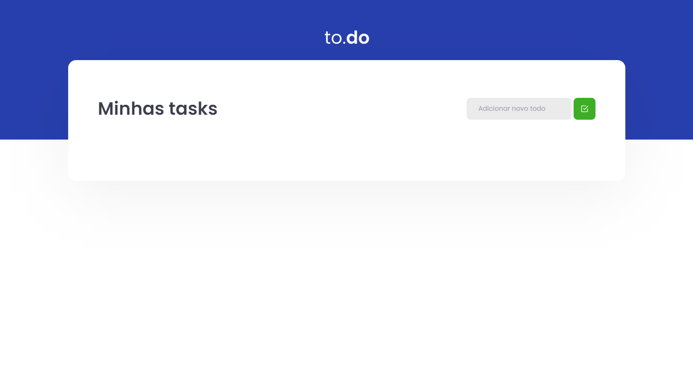

# React Task List

This project was developed as a Rocket Seat challenge, on the ReactJs trail.

## Funcionalidades

- Add and remove tasks
- Mark Tasks as Complete

## Running locally

Clone the project 

```bash
  git clone https://github.com/Torr7s/react-task-list
```

Enter the project directory

```bash
  cd react-task-list
```

Install dependencies

```bash
  npm install
```

Run the server

```bash
  npm run dev
```

## Learnings

In this project I was challenged to create a list of tasks, which could be added and removed.

The main concepts learned by this one were about state and immutability. 

## Screenshots



